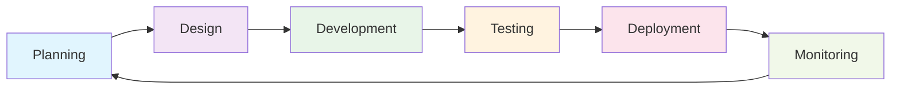

# 💻 Qusay Mutawali
### Fullstack Web Developer | API Integration Specialist | Server Administrator

---

## 🚀 About Me

I'm a passionate **Fullstack Web Developer** specializing in building **scalable** and **modern** web applications. With expertise spanning both frontend and backend technologies, I create comprehensive digital solutions that deliver exceptional user experiences.

### 🎯 Core Expertise
- **Frontend Development**: React.js, Next.js, Vue.js, Angular
- **Backend Development**: Express.js, Laravel, NestJS
- **Server Management**: VPS KVM2 Linux Ubuntu Server, Nginx
- **API Integration**: Payment Gateways, Maps, Travel APIs, Authentication Systems

---

## 🛠️ Technical Stack

### **Frontend Technologies**

### **Backend Technologies**

### **Databases & Storage**

### **Mobile Development**

<!-- 
 -->

# 📱 Flutter Development - Expanding My Mobile Tech Stack

| No | Minggu ke | Praktikum ke | Topik | Modul | Template Laporan |
|:---:|:---:|:---:|---|---|:---:|
| 1 | 01 | 01 | Pengenalan Mobile Programming dan Setup Lingkungan | [Laporan Modul 01](#) | [Repo 1](#) |
| 2 | 01 | 01 | Widget Row dan Column | [Laporan Modul 02](#) | [Repo 2](#) |
| 3 | 02 | 02 | Pengaturan Layout Row dan Column di Flutter | [Modul 03](#) | [Template laporan](#) |
| 4 | 02 | 02 | Widget Flexible dan Expanded | [Modul 04](#) | [Template laporan](#) |

### **DevOps & Infrastructure**

---

## 🔌 API Integration Expertise

I specialize in integrating complex APIs to enhance application functionality:

| **Payment Systems** | **Location Services** | **Travel & Booking** | **Authentication** |
|:---:|:---:|:---:|:---:|
| 💳 Midtrans Payment Gateway | 🗺️ Google Maps API | ✈️ Amadeus Travel API | 🔐 Firebase Auth |
| 💰 Stripe | 📍 RajaOngkir API | 🏨 Booking.com API | 🔑 OAuth 2.0 |
| 🏦 PayPal | 🌍 OpenStreetMap | 🚗 Car Rental APIs | 👤 JWT Authentication |

---

## 🏗️ Development Approach

### 🎯 **What I Focus On:**
- **📱 Responsive Design** - Mobile-first approach
- **⚡ Performance Optimization** - Fast loading times
- **🔒 Security Best Practices** - Secure coding standards
- **🧪 Testing & Quality Assurance** - Reliable applications
- **📈 Scalable Architecture** - Growth-ready solutions

---

## 🎨 Design & Tools

---

## 🤝 Let's Connect!

I'm always interested in discussing new opportunities, innovative projects, or sharing knowledge about web development. Feel free to reach out!

---

### 💡 *"Building the future, one line of code at a time"*

**⭐ If you find my work interesting, don't forget to star my repositories! ⭐**

---

